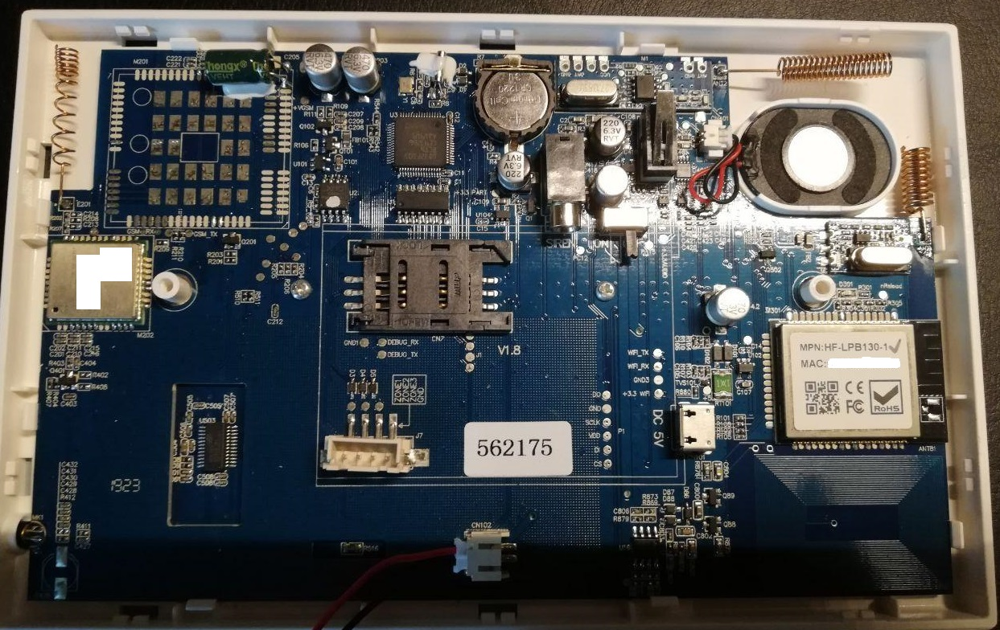
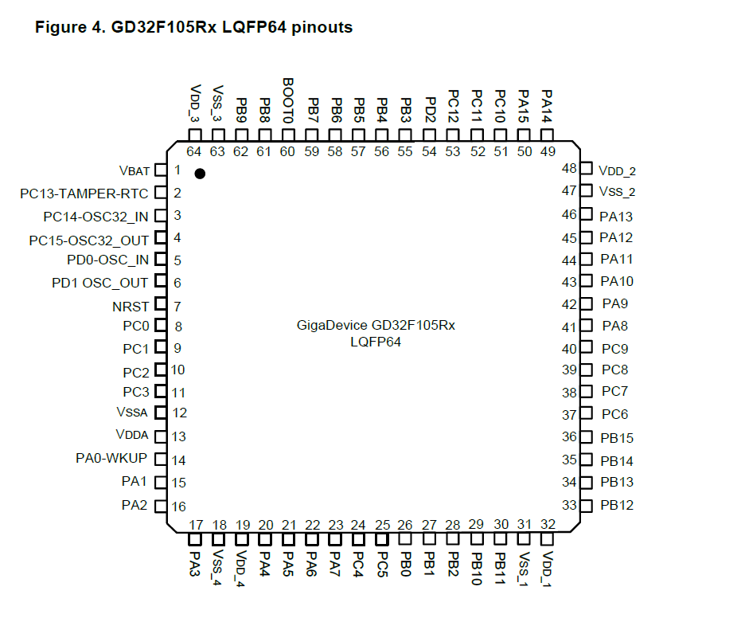

# wofea PG105 custom firmware project

- Hardware wofea PG105
    - CPU arm GD32F105/RCTb/CE93266/AJ1919
    - ROM XMC QH64AHIG (read as EON, XMC 25QH64 in CH341Programmer_v1.38?)
    - GSM Quectel M26/FB Q1-A2417/M26FB-03-TTS
    - NXP 74HC595D chip for lcd screen?
    - holtek BS83B16C as Touch Flash MCU (keyboard controller)
    - WIFI MPN: HF-LPB130-1
    - RFID LM358/96M/17226  - 125 kHz RFID
    - 433 mg hz CMT2210LB-ESR receiver
    - 433 mg transmitter (smd chip 0A8Q3) like https://github.com/nbergont/wofea_v10_hack
    - battary 500 mAh with SC-J27D-1 controller
    
 
 
 
 
 | arm pin  | dest conn |
 |----------|-----------|
 | PA10 (43)| DEBUG_RX  |
 | PA9  (42)| DEBUG_TX  |
 

